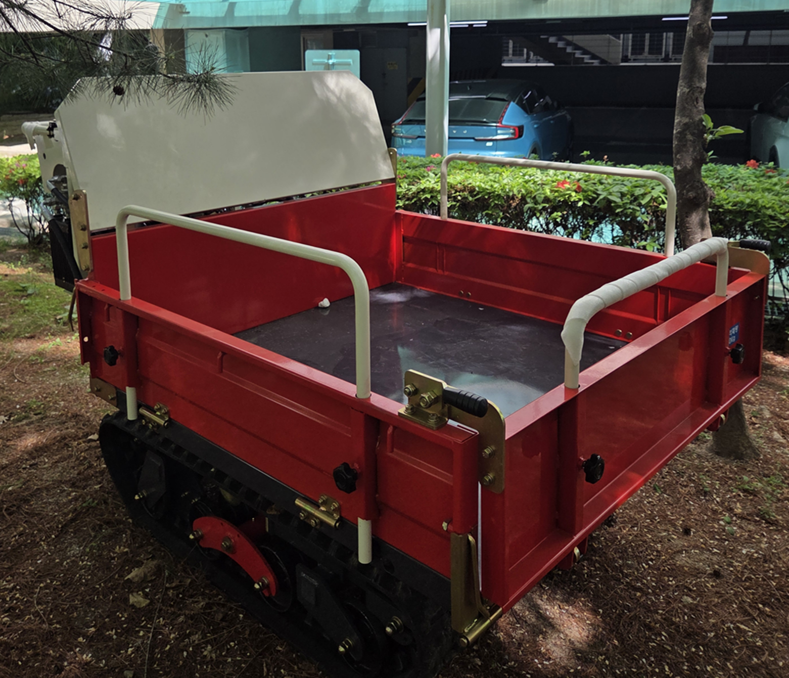
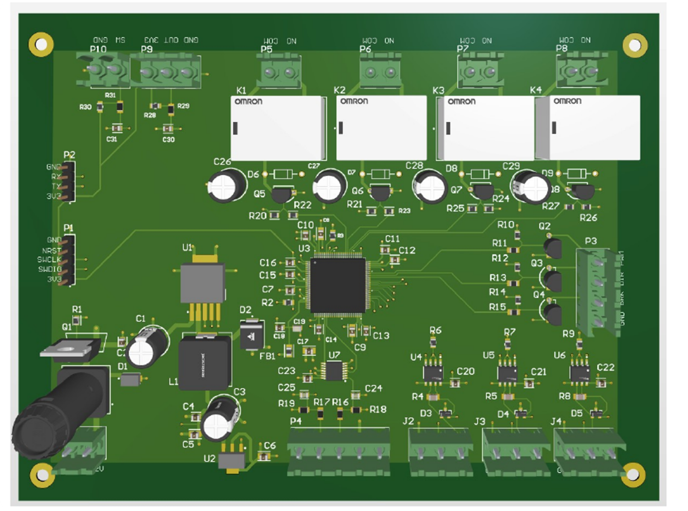
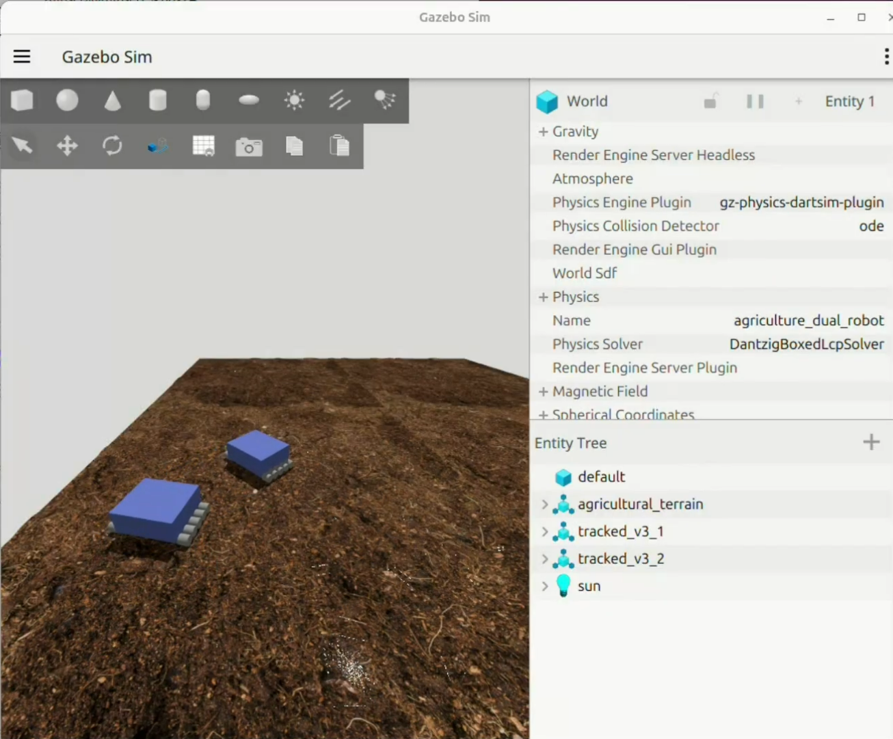

# Agricultural Vehicle Leader–Follower Control System

## Overview
This project develops a leader–follower control system for an agricultural vehicle in collaboration with Duru Machinery. The project combines STM32-based control hardware with UWB-based relative pose estimation and ROS2/Gazebo-based follower control.

### Agricultural Vehicle

## My Role
- Designed the STM32-based main control PCB interfacing sensors, communication modules, and actuators
- Implemented UWB-based relative pose estimation in ROS2
- Developed leader–follower tracking control for the follower vehicle
- Evaluated tracking behavior in ROS2/Gazebo across turning scenarios

## System Architecture
- STM32-based main control hardware
- UWB-based relative positioning
- ROS2 communication and control
- Leader–follower tracking controller
- Gazebo simulation environment

### STM32 Main Control PCB (3D Render)

## Validation
The leader–follower control algorithm was validated in simulation using ROS2/Gazebo. Hardware development and control-algorithm validation were conducted as separate parts of the project.

### ROS2/Gazebo Simulation

